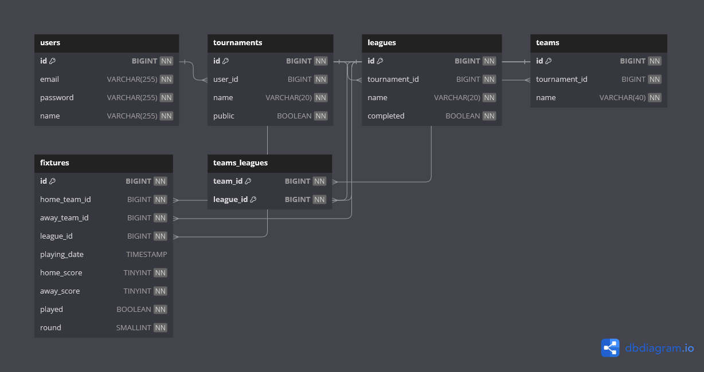

# Database

This project uses a MySQL database to store data about tournaments.
The database includes tables for users, tournaments, teams, and fixtures.

## Database Schema

- `tournaments`: This table stores data about each tournament
- `leagues`: This table stores data about each league
- `teams`: This table stores data about each team
- `users`: This table stores data about each user
- `fixtures`: This table stores data about each fixture
- `teams_leagues`: This table stores data about the participating teams in leagues

## Configuring the database

Please head over to the [Configuring the project](/#step-3) from step 3 for a detailed explanation on how to configure the database.
